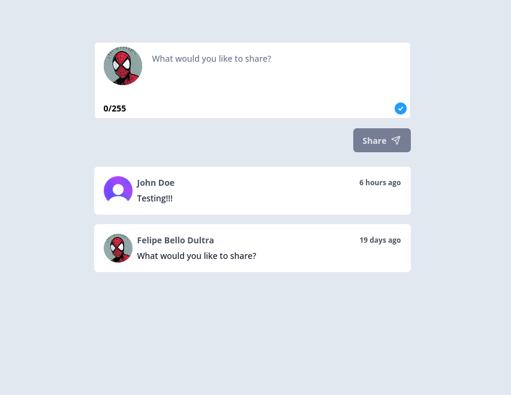
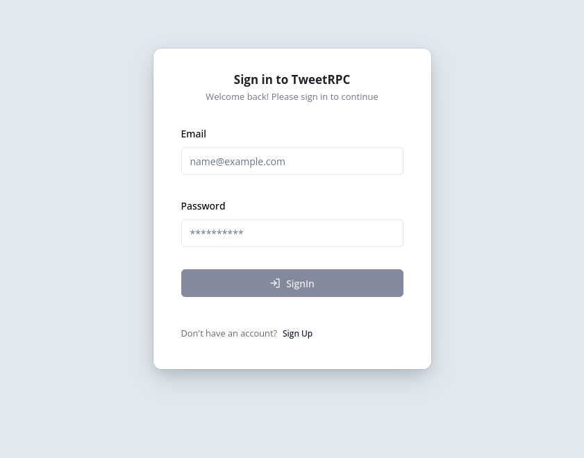

# tweetRPC 🐦

tweetRPC is a Twitter-inspired app built with the [t3 stack](https://create.t3.gg/), offering end-to-end type safety using [tRPC](https://trpc.io/). The app includes user authentication via [Clerk](https://clerk.com/), seamless database interactions with [Prisma](https://www.prisma.io/), and modern UI components powered by [shadcn](https://ui.shadcn.com/).

## 🎨 Preview

Live demo: https://tweetrpc.vercel.app/

<p align="center">
  
  
</p>

## 🚀 Features

- **Authentication**: Secure login and account creation powered by [Clerk](https://clerk.com/).
- **Post Creation**: Create and share posts with other users.
- **Infinite Scroll**: Enjoy an uninterrupted browsing experience with infinite scrolling.
- **End-to-End Type Safety**: Achieved through the integration of [tRPC](https://trpc.io/).
- **Minimalistic UI**: Built with [shadcn/ui](https://ui.shadcn.com/), ensuring a modern and consistent design.
- **Form Management**: Effortlessly handle forms using [React Hook Form](https://react-hook-form.com/).
- **Database**: Robust and scalable data storage using PostgreSQL, deployed via [Railway](https://railway.app/).

## 🛠️ Tech Stack

- **Frontend Framework**: [Next.js 14](https://nextjs.org/)
- **Type Safety**: [tRPC](https://trpc.io/)
- **Authentication**: [Clerk](https://clerk.com/)
- **UI Components**: [shadcn/ui](https://ui.shadcn.com/)
- **Form Handling**: [React Hook Form](https://react-hook-form.com/)
- **Database**: [PostgreSQL](https://www.postgresql.org/) (via [Prisma](https://www.prisma.io/))
- **Hosting**: [Vercel](https://vercel.com/) for the app, [Railway](https://railway.app/) for the database
- **CI/CD**: GitHub Actions for automated workflows

## 📦 Getting Started

### Prerequisites

- Docker installed (docker compose to container management)
- Node 20+ installed
- A Clerk account for authentication ([Sign up here](https://clerk.com/))

### Installation

1.  Clone the repository

```bash
git clone git@github.com:FelipeBelloDultra/tweetrpc.git
cd tweetrpc
```

2. Set up the environment variables with your data

```bash
cp .env.example .env
```

3. Install dependencies

```bash
npm ci
```

4. Up database container

```bash
docker compose up -d postgres_db
```

5. Run database migrations

```bash
npm run db:generate
```

6. Start server

```bash
npm run dev
```

_You can up all containers run just `docker compose up -d`_

## 🌟 Acknowledgments

- [t3 stack](https://create.t3.gg/)
- [Clerk](https://clerk.com/)
- [shadcn/ui](https://ui.shadcn.com/)
- [tRPC](https://trpc.io/)
- [Railway](https://railway.app/)
- [Vercel](https://vercel.com/)
